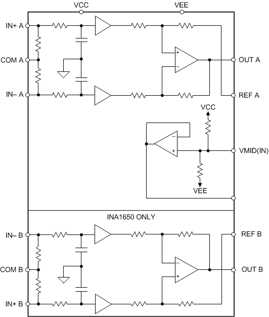

## Texas Instruments
## INA1650

Dual SoundPlus™ high common-mode rejection (91-dB), low THD+N (-120-dB) differential line receiver

### Datasheet

[INA165x SoundPlus™ High Common-Mode Rejection Line Receivers datasheet (Rev. B)](http://www.ti.com/lit/gpn/ina1650)

### Features

- High	Common-Mode Rejection: 91 dB (Typical)
- High Input Impedance: 1-MΩ	Differential
- Ultra-Low Noise: –104.7 dBu, Unweighted
- Ultra-Low Total Harmonic Distortion + Noise: –120 dB THD+N (22 dBu, 22-kHz Bandwidth)
- Wide Bandwidth: 2.7	MHz
- Low Quiescent Current: 6 mA (INA1651, Typical)
- Short-Circuit Protection
- Integrated EMI	Filters
- Wide Supply Range: ±2.25 V to ±18 V
- Available in	Small 14-Pin TSSOP Package

### Description

The dual-channel INA1650 and single-channel INA1651 (INA165x) SoundPlus™ audio line receivers achieve an extremely-high common-mode	rejection ratio (CMRR) of 91 dB while maintaining an ultra-low THD+N of –120 dB at 1 kHz for 22-dBu	signal levels. Precision matching of on-chip resistors give the INA165x devices excellent CMRR	performance. These resistors have matching that is far superior compared to external components,	and are immune to mismatches introduced by printed circuit board (PCB) layout. Unlike other line receiver products, the INA165x CMRR is characterized over temperature and tested in production to	deliver consistent performance in a wide variety of applications.

The INA165x devices operate over a very-wide-supply range of ±2.25 V to ±18 V, on 10.5 mA	of supply current. In addition to the line-receiver channels, a buffered mid-supply reference	output is included, making the INA165x configurable for dual- or single-supply applications. The	mid-supply output can be used as a bias voltage for other analog circuitry in the signal chain.	These devices are specified from –40°C to +125°C.

### Diagram

